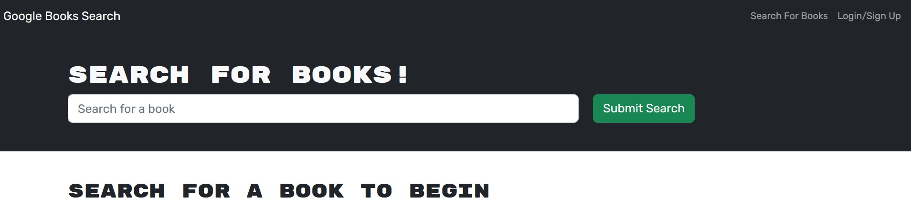

  # [](https://opensource.org/licenses/MIT)

  # Book Search

  ## Table of Contents
 - [Description](#description)
 - [Installation](#installation)
 - [Usage](#usage)
 - [License](#license)
 - [Test Instructions](#test-instructions)
 - [Credits](#credits)
 - [Questions](#questions)
  
  ## Description
  This application is a refactor of a fully functioning Google Books API search engine built with a RESTful API. It has been reactored to be a GraphQL API built with Apollo Server. The app was built using the MERN stack with a React front end, MongoDB database, and Node.js/Express.js server and API. The application uses JWT authentication. It allows users to search for books. Returned book data includes title, description, authors and book image. User can sign up and once logged in they can save book searches to the back end and later remove books from their saved book list. 
  
  The application is developed using the following technologies:
  - Javascript
  - Node.js
  - Express.js
  - MongoDB
  - Mongoose
  - React
  - GraphQL

  The main challenge in developing this application was familiarisation with GraphQL and JWT. 


  ## Installation
  Ensure node is installed. Test by running 
  ```
  node -v
  ```

  To build this application run:
  ```
  npm run build
  ```

  

  ## Usage
  To run this application ensure you are in the main graphql-book-search-engine directory. 
  
  To run in development mode run:
  ```
  npm run develop
  ```


You should see the application startup message:


Once the server is running you can open your browser and enter:
```
http://localhost:3001/

```

You will be presented with the Home Page:



To sign up or login click the "Sign Up/Login" link complete your details and click "Submit".


Once logged in you can search for books and save your choices


To delete your choices from your saved list navigate to "See your books" and click the delete button.


When you are finished, click "Logout" to logout.

To view the deployed application click on the link below:

[Book Search](https://graphql-google-book-search.herokuapp.com/)


  ## License
  This project is covered by the "The MIT License" license.
  For more details click on the link below:
  [License](https://opensource.org/licenses/MIT)
  
  
  ## Test Instructions
  The application can be tested by following the instructions above under the Usage section.


  ## Credits
  I would like to thank the instructors at UWA Bootcamp. 
  
  ## Questions
 If you have any questions or feedback please contact me. My details are below. As this is a learning challenge for me I would appreciate any feedback, or ideas for improvement.

